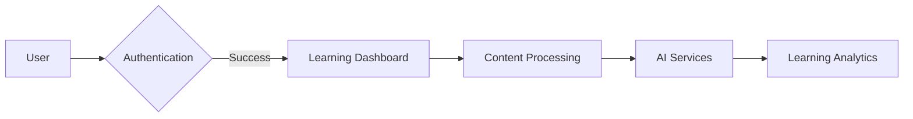

# LearnLab 🚀 <sub><sup>_Enhancing Learning Through Interactive Journeys_</sup></sub>

[](https://github.com/DAMG7245-Big-Data-Sys-SEC-02-Fall24/LearnLab)
[](http://34.45.163.161:3000/)
[](http://34.45.163.161:8000/docs)
[](https://www.python.org/)
[](https://fastapi.tiangolo.com/)
[](https://nextjs.org/)

<div align="center">
  
</div>

## 🎯 Key Features

| Feature | Description | Tech Stack |
|---------|-------------|------------|
| 🎙️ Smart Podcasts | AI-generated audio content from PDFs with dramatic narration | OpenAI, 11 Labs |
| 📚 Adaptive Flashcards | Context-aware flashcards with spaced repetition | Pinecone, Gemini 1.5 |
| 🧠 Intelligent Quizzes | Dynamic question generation with analytics | LangGraph, PyPDF |
| ✍️ Content Conversion | Automated blog/social media post generation | Vercel AI SDK |

## 🚀 Quick Start

```bash
# Clone with submodules
git clone --recurse-submodules https://github.com/DAMG7245-Big-Data-Sys-SEC-02-Fall24/LearnLab

# Start core services
docker-compose up -d backend frontend db 

# Verify installation
curl http://localhost:8000/healthcheck
```

## 🏗️ System Architecture



## 📦 Project Structure

```
LearnLab/
├── frontend/          # Next.js 13 App Router
│   ├── app/          # Page routes
│   └── lib/          # Shared utilities
├── backend/          # FastAPI microservices
│   ├── core/         # Domain logic
│   └── api/          # REST endpoints
└── airflow/          # Data pipelines
```

## 🚢 Deployment

| Environment | Command | Port |
|-------------|---------|------|
| Development | `docker-compose up --build` | 3000 |
| Production | `docker-compose -f prod.yml up` | 80 |

Monitor services:
```bash
docker-compose logs -f --tail=100
```

## 🤝 Contributing

We welcome contributions! Check out our [contribution guidelines](CONTRIBUTING.md).

**Good First Issues:**
- [ ] Add dark mode support 🌓
- [ ] Implement mobile app integration 📱 
- [ ] Enhance PDF parsing accuracy 📄

## 📜 License

MIT Licensed - See [LICENSE](LICENSE) for details.

---

<div align="center">
  Made with ❤️ by Team LearnLab
  
  [Live Demo](http://34.45.163.161:3000/) | [Documentation](https://codelabs-preview.appspot.com/?file_id=1uRDRgIq0stv5MiOj-4f0KLE3mzC15eOw9zI4dzttLGg#0)
</div>
